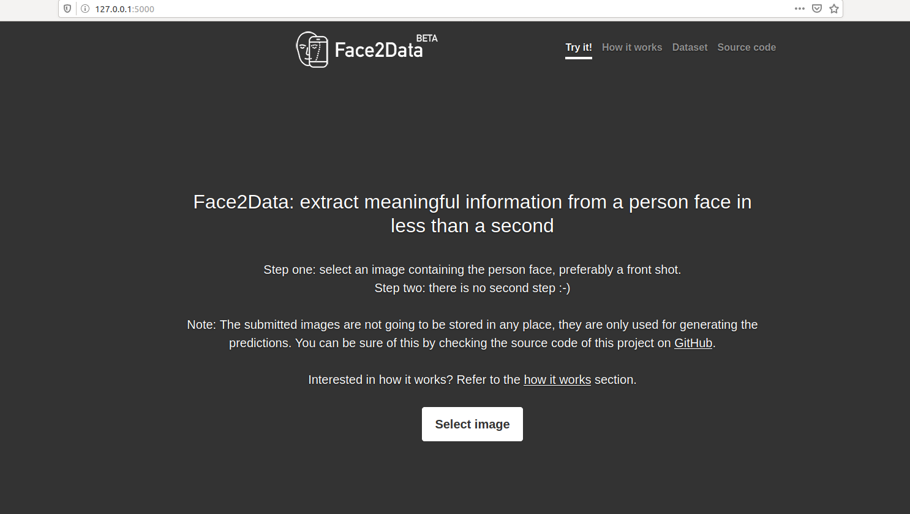

[](https://www.python.org/)
[](https://travis-ci.org/rodrigobressan/face2data)
[](https://coveralls.io/github/bresan/face2data?branch=master)
[](https://github.com/rodrigobressan/face2data/blob/master/LICENSE.md)

[](https://heroku.com/deploy)

## Extract information from a person face in less than a second

This project is intended to showcase the usage of a Keras multi-output model to predict age, gender and ethnicity from a given persons face. The generated model is served through a REST API provided by Flask running on Python 3.6.

## Running the project

### Using Docker

If you want to quickly build and run the server, you can use Docker.
First, install [docker](https://docs.docker.com/install/) for your architecture.
Then build the container:


```bash
$ docker build -t face2data .
```

The container will use gunicorn to deploy the application on port 5000. You
thus should run the container and map this port to your host:


```bash
$ docker run -p 5000:5000 face2data
```

You can then open your browser to [http://127.0.0.1:5000/](http://127.0.0.1:5000/)
to see the interface.



### From Source

A live demo of application is available on the [https://face2data.herokuapp.com/](https://face2data.herokuapp.com/) address (it may take some time to load due to Heroku's free plan), but if you instead would like to run it locally, below are the needed steps:

In order to run this project locally, you first need to clone this repository into our machine and then install the required dependencies. The project dependencies are located in the requirements.txt file. You can install them by using [PiP](https://pip.pypa.io/en/stable/), as below:

```bash
pip install -r requirements.txt
```

After this, navigate to the project root directory and run the following command on the terminal to start the application:

```bash
flask run
```

This should start a new server on the port 5000. You can then access the applicaton by opening the address [http://localhost:5000/](http://localhost:5000/) on the browser.

## The dataset

The UTKFace dataset is a large dataset composed of over 20 thousand face images with their respective annotations of age, gender and ethnicity. The images are properly cropped into the face region, but display some variations in pose, illumination, resolution, etc. If you want to know more about this dataset, please check their [website](https://pip.pypa.io/en/stable/).

<br/>

## Training phase

Our Neural Network is composed of three major branches, one for each of the features we are trying to predict. We have used a default set of hidden layers, based on the stacking of several Conv2D with ReLU activation, followed by a Batch Normalization, then a MaxPooling and finally a Dropout layer.

We performed our training phase by adopting an Adam optimizer with a learning rate of 1e-4 and a decay based on the initial learning rate divided by the number of epochs. A hundred epochs were used to train our model, in which we have seen that we had an efficient learning process, asserted by plotting both the accuracy and loss curves, as shown below:

### Accuracy for gender feature

<div style="width: 100%; text-align: center">
    
</div>


### Accuracy for race feature

<div style="width: 100%; text-align: center">
    
</div>


### Mean Absolute Error for age feature

<div style="width: 100%; text-align: center">
    
</div>


### Overall loss

<div style="width: 100%; text-align: center">
    
</div>

## TODO

- Add unit tests for both Flask application and model predictions
- Setup Continuous Integration and Deployment to automatically deploy on Heroku upon a new commit
- Add SHAP model explanations

## References

UTK Face Dataset: [http://aicip.eecs.utk.edu/wiki/UTKFace](http://aicip.eecs.utk.edu/wiki/UTKFace)

Keras Multi-output documentation: [https://keras.io/getting-started/functional-api-guide/](https://keras.io/getting-started/functional-api-guide/)

SanjayaSubedi post on multi-output model: [https://sanjayasubedi.com.np/deeplearning/multioutput-keras/](https://sanjayasubedi.com.np/deeplearning/multioutput-keras/)

PyImageSearch post on FashionNet: [https://www.pyimagesearch.com/2018/06/04/keras-multiple-outputs-and-multiple-losses/](https://www.pyimagesearch.com/2018/06/04/keras-multiple-outputs-and-multiple-losses/)

Plotly: [https://plot.ly/](https://plot.ly/)
